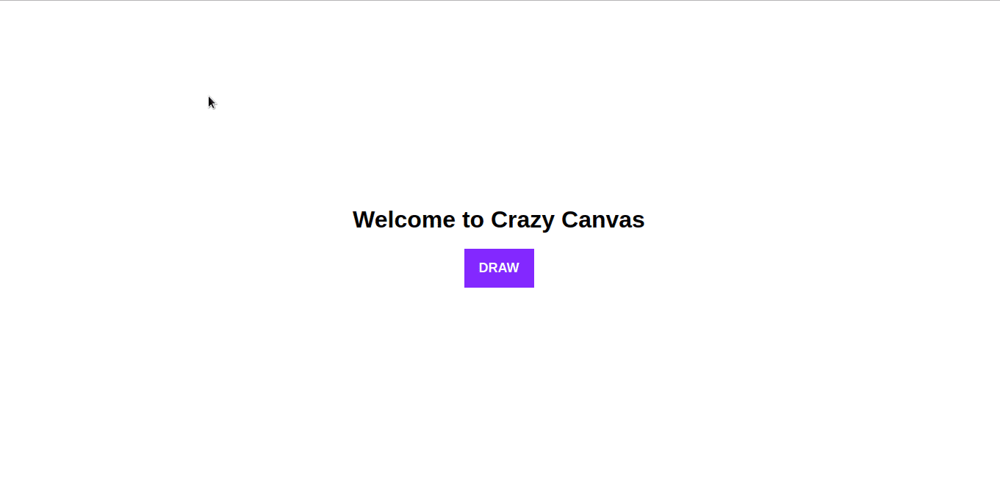

# crazy-canvas

> A web-app to generate random patterns with random colors and draw width.

### Usage
Click and hover mouse around the screen :grinning:.

### Demo

### Features
* Colours changing with time.
* Oscillating draw width.
* Save your pattern by simply right clicking over the canvas.

### Todo
* Add other overlap effects.
* Add a color palette (random colours could be annoying for some users).
* Add other brush effects in a button group.

### License
MIT © [Anshuman Verma](https://github.com/Anshuman-Verma)